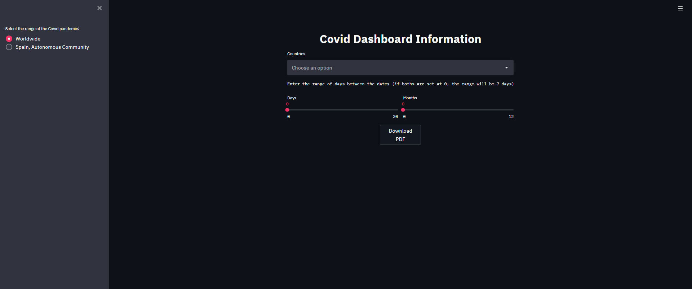
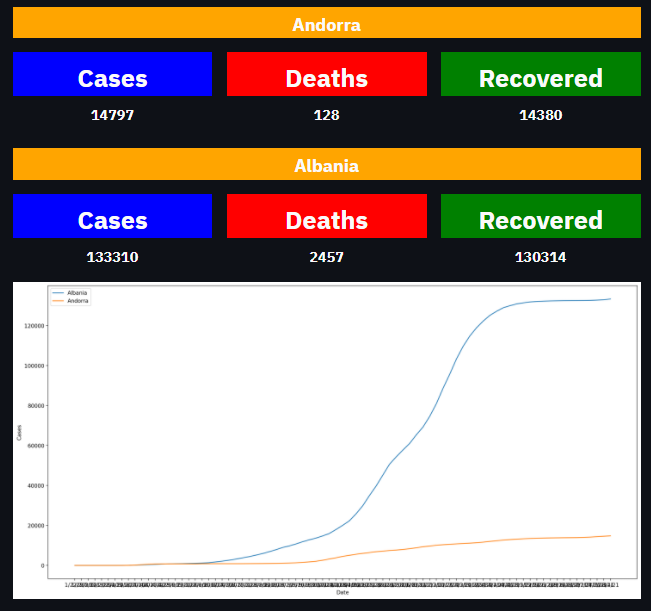
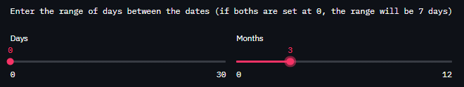
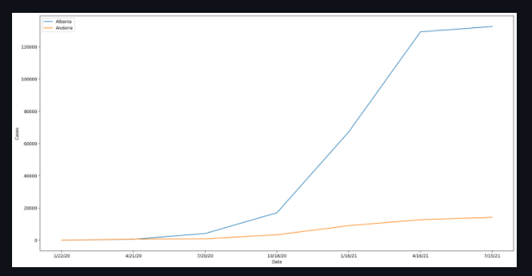
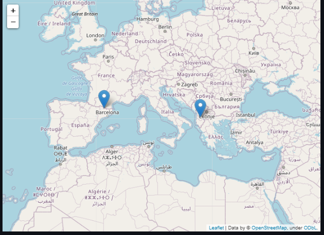
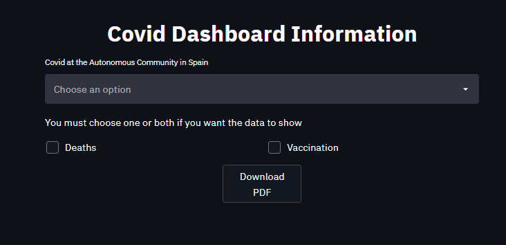
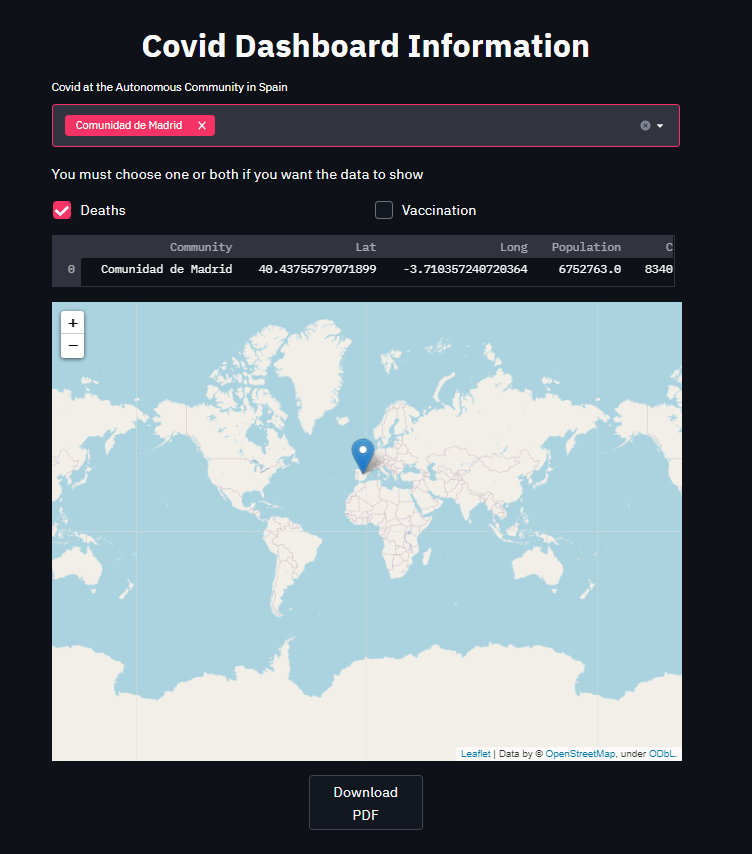

# Informative Dashboard about Covid Pandemic


Little proyect about an API and a Dashboard focused in the Covid Pandemic. The dashboard show information about the cases, deceases and vaccinations around the world.


## Table of Content
---
- [Goals](#Goals)
- [Installation](#Installation)
- [How to use it](#How-to-use-it)
- [What expected to get](#What-expected-to-get)
- [Requests to the API](#Requests-to-the-API)
  - [World Wide](#World-Wide)
  - [Autonomous Communities](#Autonomous-Communities)

## Goals
---
### L1
- [x] Create Api in flask
- [x] Create Dashboard in streamlit
- [x] Database in **MongoDB** or PostgreSWL
### L2
- [x] Use of geospatial data and geoqueries in MongoDB or Postgres (Using PostGIS)
- [x] Have the database in the Cloud (There are free services in MongoDB Atlas, Heroku Postgres, dentre others)
- [x] Generate pdf report of the data visible in Streamlit, downloadable via button.
- [x] A multi-page dashboard in Streamlit.
### L3
- [ ] Have the dashboard send you the pdf report by e-mail
- [ ] To be able to upload new data to the database via API (username and password as request headers)
### L4
- [ ] To be able to update the database via Streamlit (with username and password, in a separate page. The dashboard must make the previous request that adds data via API)
- [ ] Create Docker container and deploy the services in the cloud (Heroku. The two services must be uploaded separately)

## Installation
---
It's necesary to have installed all the libraries of the [requirements.txt](requirements.txt) file. Once you have installed all, you can start running the server and the covid's dashboad

## How to use it
---
To run the dashboard, you just need to put in the console, in the same level where you have the file [streamlit.py](src/streamlit.py), the next commands:
```
streamlit run streamlit.py
```

If all worked OK, in the console you must have an IP direcction. Copy and paste the IP in your internet explorer and you shoud have acces to the dashboard.


## What expected to get
---
This dashboard is focused in show in a simple format data about the Covid19 Pandemic. The cases of covid, deaths and recovered people in every country around the world up to date. Also, it show a graphic about the evolution of covid for every country you selected.


You can choose a range of days to show the covid evolution. For example, you can choose to se the evolution evey seven days, or every 20 days, or even every 3 months. You just need to adjust the values and wait for the graph the show the data.




It also show a map of the world with a mark in every country you selected to see the data.



To end the first page of the dasboard, there is a button the let you download the data from the graph and the graph it self. The data of the graph is in JSON format, so you can use it in other project just by copy and paste it.
___
The second page of the dashboard will focused on the cases in Autonomous Communities in Spain. In this case, the data will be showed as a table and the data will depend the type of data that you want to show. In this case, "Deaths" or "Vaccination".




## Requests to the API
---
Next, we will put every API request with a small descripion about the expected response and, in case it need any web parameters, how to put them in the url.

There will be variables where you have to write the names certain type of data. Below, we will show you how to identify the variables and the type of data you should write.

Every variable will be represented between <>
- **<db_collection>** There are 3 database from where you can get the data.
  - covid: It contains the evolution over the time of the covid cases
  - deaths: It contain the evolution of deceased people over the time 
  - recovered: It contain the evolution of recovered people over the time
- **\<countries>** In this variable, you must write the countries you want to get the data. This countries must be separated by commas without spaces. (Spain,Germany,Andorra,etc.)

### World Wide
- `https://covid-evolution-api.herokuapp.com/countries` -> Return a JSON with all the names of the countries
- `https://covid-evolution-api.herokuapp.com/<db_collection>/data/<countries>` -> Return a JSON with the data of the countries listed in \<countries> part.
- `https://covid-evolution-api.herokuapp.com/coord/<countries>` ->Return a JSON with the coordenates of the selected countries
- `https://covid-evolution-api.herokuapp.com/<db_collection>/countries/total` -> Return a JSON with the total people affected by the covid up to date.
- `https://covid-evolution-api.herokuapp.com/<db_collection>/total/<countries>` -> Return a JSON of the total people affected by the covid for the selected countries.
- `https://covid-evolution-api.herokuapp.com/<db_collection>/<countries>/date_range` -> Return a JSON with the data of the selected countries between two defined dates. For this request, you need to use web parameters. Here is and example:
  ```
  https://covid-evolution-api.herokuapp.com/covid/Spain,Andorra/date_range?Start=4/23/20&End=6/23/20
  ```
  As we can see, the web parameters must be **Start** and **End** and the date must be **mm/dd/yy**
- `https://covid-evolution-api.herokuapp.com/<db_collection>/<countries>/date_interval` -> Return a JSON with the data of the selected countries but with an intervale between the dates specified by web parameter. Here is an example:
  ```
  https://covid-evolution-api.herokuapp.com/covid/Spain,Andorra/date_interval?7
  ```
- `https://covid-evolution-api.herokuapp.com/<db_collection>/<countries>/<interval>/date_range` -> This is and union between two requests. The interval request and the date range. It let you specified a range of dates and, in that range, set an interval betweem days. For example:
  ```
  https://covid-evolution-api.herokuapp.com/covid/Spain,Andorra/7/date_range?Start=4/23/20&End=7/23/20
  ```
  This request will return a JSON with the data between 4/23/20 and 7/23/20 but, only every 7 days. The result it's that you will get the data of the dat 23/4/20, follow by 30/4/20, 7/5/20, etc. Until 7/23/20.

### Autonomous Communities
The variables in this request are a little different than the request of the countries. Now we will show the possible values:
- **<db_collection>** In this case, there is only 2 databases
  - ccaa_covid_data -> Contain the data of the covid for every Autonomous Community
  - ccaa_covid_vac -> Contain the data of the vaccination for every Autonomous Community
- **\<communities>** You must write the names of the autonomous communities you want to get the data. The format is the same as the \<countries> variable.


- `https://covid-evolution-api.herokuapp.com/ccaa_covid_data/communities` -> Return a JSON with the data of the covid for every Autonomous Community
- `https://covid-evolution-api.herokuapp.com/<db_collection>/<communities>/data` -> Return a JSON with the data for the selected Autonomous Communities for the specified collection.
- `https://covid-evolution-api.herokuapp.com/<communities>/coord` -> Return a JSON with the coordenates 
- `https://covid-evolution-api.herokuapp.com/ccaa_covid_data/<communities>/population` -> Return a JSON with the total population for the selected Autonomous Communities.
- `https://covid-evolution-api.herokuapp.com/ccaa_covid_data/<communities>/cases` -> Return a JSON with the total cases for the selected Autonomous Communities
- `https://covid-evolution-api.herokuapp.com/ccaa_covid_data/<communities>/deceased` -> Return a JSON with the total deceased for the selected Autonomous Communities
- `https://covid-evolution-api.herokuapp.com/ccaa_covid_vac/<communities>/doses` -> Return a JSON with the total doses distributed for the selected Autonomous Communities
- `https://covid-evolution-api.herokuapp.com/ccaa_covid_vac/<communities>/vaccinated_people` -> Return a JSON with the total number of people vaccinated with the first dose for the selected Autonomous Communities
- `https://covid-evolution-api.herokuapp.com/ccaa_covid_vac/<communities>/full_vaccinated` -> Return a JSON with the total number of people that have received all their doses for the selected Autonomous Communities
- `https://covid-evolution-api.herokuapp.com/ccaa_covid_vac/<communities>/%_vaccinated` -> Return a JSON with the percent of vaccinated people for the selected Autonomous Communities